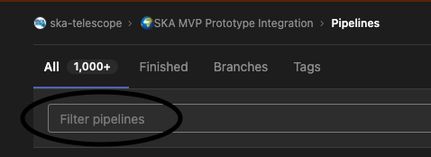

# README
[](https://developer.skatelescope.org/projects/skampi/en/latest/?badge=latest)

## Before you begin
The documentation for SKAMPI is currently being reworked. To look at the documentation that was available before this rework started, please go to [this temporary build on ReadtheDocs](https://developer.skao.int/projects/skampi/en/sp-1747-docs-old/).

For information on how to use the subsystems / components that are deployed using SKAMPI, please first look at the documentation on [SKAMPI Subsystems](https://developer.skao.int/projects/skampi/en/latest/subsystems.html)

If you're developing (or planning to develop or contribute to) a component or subsystem that is to be integrated in a Kubernetes cluster, read on. If you are a tester, it is also recommended that you gain at least a basic understanding of the concepts before jumping to the section on [Testing](#testing).
### SKA Tango Examples and Tango Images
If your component or product is ready for integration, skip the following sections and go to [Development](#development).

A basic understanding of the [SKA Tango Examples](https://gitlab.com/ska-telescope/ska-tango-examples/) repository is required before attempting to integrate a component on SKAMPI. Please clone the repository and base your development on the examples given there. Pay particular attention to how deployment and partial integration is demonstrated using Helm. It will be helpful to follow the SKAMPI [Documentation on Helm](https://developer.skao.int/projects/skampi/en/latest/helm.html) while you are doing this. There are also links to the documentation on Container Orchestration which you should also follow.

The SKA Tango Base and Tango Util Helm charts are required by most of the deployments that are integrated in SKAMPI. It is therefore also worth your while to look at the [SKA Tango Images](https://gitlab.com/ska-telescope/ska-tango-examples/) repository. The deployment workflow is very similar to SKAMPI.
### Kubernetes and Kubectl
For information on Kubernetes and Kubectl, a quick list of references is available [here](https://developer.skao.int/projects/ska-skampi/en/latest/kubernetes.html). You also might want to have a look at 
## Deployment

### Local Minikube / dedicated server deployment
The full deployment of SKAMPI is currently resource intensive and requires more than 11 MB RAM to run. If you want to deploy SKAMPI locally or on a dedicated server, you can follow the guidelines on [Deployment](https://developer.skao.int/projects/ska-skampi/en/latest/deployment.html).

For a local deployment using a Minikube cluster, install Minikube, Docker and Helm (see #minikube etc). A Minikube cluster is a kubernetes cluster with only one node (your laptop is called a node), which acts as the master and worker node. The SKA Minikube repository also provides an ingress to expose your cluster's deployment to the outside world if needed.

Installation/Deployment of SKAMPI is much simpler using the Gitlab CI Pipelines, as everything required to set up the environment is included in the CI infrastructure. As all branches should be named after a Jira ticket, you need a Jira ticket before checking out your branch. 

Let's say your ticket is AT-42. Check out your branch (do this from the root directory of the SKAMPI project)
```
➜  skampi git:(master) git checkout -b at-42
Switched to a new branch 'at-42'
```
Now push this new branch to Gitlab:
```
➜  skampi git:(at-42) git push --set-upstream origin at-42
Total 0 (delta 0), reused 0 (delta 0), pack-reused 0
remote: 
remote: To create a merge request for at-42, visit:
remote:   https://gitlab.com/ska-telescope/ska-skampi/-/merge_requests/new?merge_request%5Bsource_branch%5D=at-42
remote: 
To gitlab.com:ska-telescope/ska-skampi.git
 * [new branch]        at-42 -> at-42
 ```

You can now create your Merge Request by following the link that is provided by Git - in most terminals you can follow that link by Ctrl+Clicking on the link (Cmd+click on a Mac). Alternatively, you can just go to your branch: https://gitlab.com/ska-telescope/ska-skampi/-/tree/at-42. (note that your branch is named different from at-42)

We recommend creating a Merge Request and marking it Draft as soon as possible. Stale branches will be removed eventually.

If you know your way around Gitlab, find the pipeline that just executed on your branch. If not, go to the [Pipelines](https://gitlab.com/ska-telescope/ska-skampi/-/pipelines) page and click in the Filter pipelines box:


If you just navigated to your branch, you should click on 
### Minikube
For a local installation of a Minikube cluster, we recommend you use the SKA Deploy Minikube repository.
#### Docker

First install Docker - follow [these instructions](https://docs.docker.com/get-docker/)

#### Minikube setup
To set up your Minikube cluster for local SKAMPI deployment, follow [these instructions](https://gitlab.com/ska-telescope/sdi/ska-cicd-deploy-minikube/). For first-time setup, do the following:
```
git clone git@gitlab.com:ska-telescope/sdi/ska-cicd-deploy-minikube.git
cd ska-cicd-deploy-minikube
make all
eval $(minikube docker-env)
```

*Please note that the command `eval $(minikube docker-env)` will point your local docker client at the docker-in-docker for minikube. Use this only for building the docker image and another shell for other work.*

Once your minikube cluster is running, you can deploy 


### Helm

## Development
The following sections are aimed at developers who want to integrate their products/components, or who want to add integration or system-level tests to the repository.

### Adding a new product/component

### Modifying deployment configuration

### Testing

## FAQ

## Getting Help
