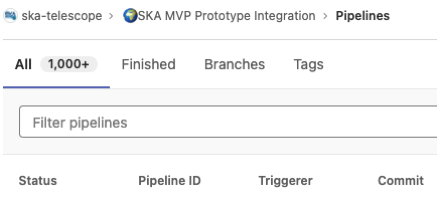
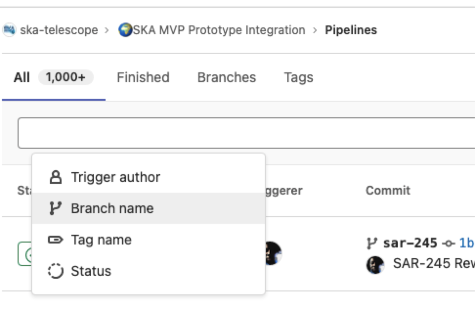
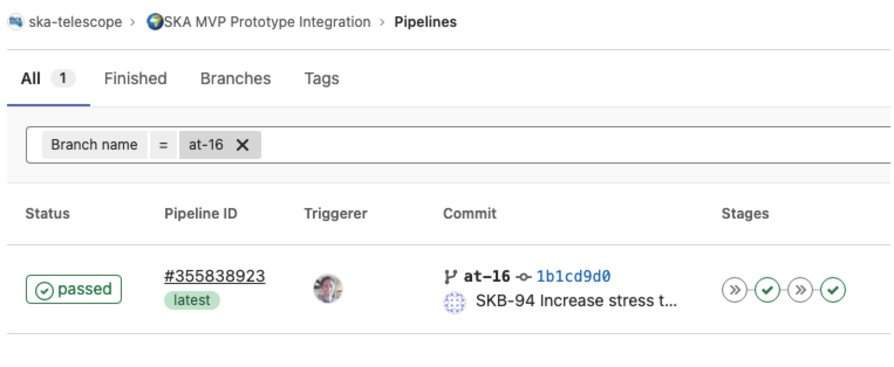
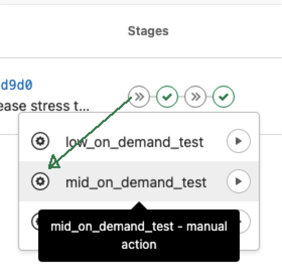
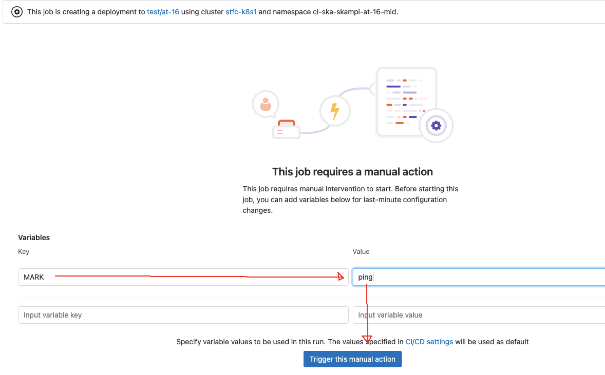
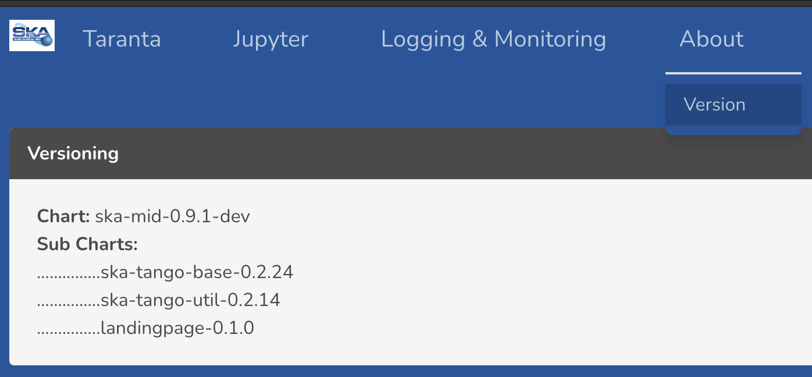
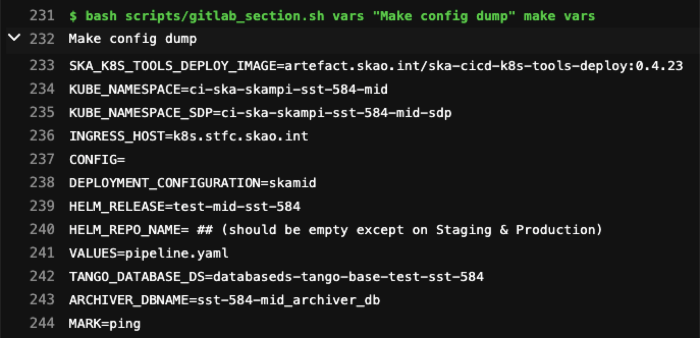

.. _`Multitenancy`:

Cloud deployments in branch-named namespaces
********************************************

Multiple deployments of SKAMPI can be deployed on the Kubernetes clusters at the same time without affecting their individual performance. Separation is achieved by kubernetes namespaces and ensures that each CI job runs isolated from others.

This "multitenancy" is implemented not only in the *permanent* Integration and Staging environments of SKAMPI, but also on the temporary Pipeline environments and this has important implications for feature branch development. 
 
Multitenancy of the branch pipelines allows for the owners of a given CI Pipline run to access logs, investigate problems, test things, without worrying that the performance of other jobs running in the cluster is affected. In order to achieve this users need to be able to retrieve a kubeconfig file giving access to the cluster. Such a file is generated automatically by the pipelines running on SKAMPI  providing access only to the namespace specific for that pipeline, thus assuring that users will not interfere with other jobs running in the cluster.

Kubernetes access to feature branch development namespaces
==========================================================

Developers may not be able to simulate the targeted deployment environment by using, for example, a Minikube cluster running on their local machines. The Pipeline Testing environment allows users to treat it as a Development environment. Pipeline Testing includes the following features:

* Standard naming conventions allowing for a Namespace per development branch.
* The same Resource Quotas and Limit Ranges as those that are applied to Staging and Integration environments.
* Access to the temporary branch-based Namespace within the Kubernetes Cluster provided through a customized ``KUBECONFIG`` file.

.. warning::

    Branch-based deployments are complete deployments of MID or LOW, and therefore require the same resources as any other deployment of SKAMPI - developers should be mindful of the impact of deployments. As such *branch-based namespaces are short lived: they are deleted 2 hours after their deployment*, and only manually deployed for persistence - automatic test deployments will be deleted immediately.

How feature branch namespaces are created in the CI pipelines
-------------------------------------------------------------

For SKAMPI Gitlab CI pipeline testing Kubernetes Namespaces are named automatically and as such users must be aware of the naming scheme. The name for the pipeline Namespace is of the form ``ci-<project name>-<branch name>``. For SKAMPI a ``-low`` or a ``-mid`` is appended at the end of the name depending on the telescope. For example, for a SKAMPI project branch named *at-51* and for a deployment involving  the MID telescope the corresponding Namespace name would be ``ci-skampi-at-51-mid``. We note that it is important to keep branch names reasonably short since Kubernetes truncates Resource names at 63 characters. 

It is also very important to follow strict **RFC 1123 naming conventions** since we will be using the Namespace name in many resources. Those conventions are enforced in our project settings. Branch names should not contain uppercase letters nor simbols other than ``-``. For example, if you try to name your development branch  *AT-51_test* a ``push`` to the SKAMPI repository will give the following error message:

::

 remote: GitLab: Branch name does not follow the pattern '^[a-z0-9]([-a-z0-9]*[a-z0-9])?$'
 To https://gitlab.com/ska-telescope/ska-skampi.git
 ! [remote rejected]   AT-51_ test -> AT-51_ test (pre-receive hook declined)
 error: failed to push some refs to 'https://gitlab.com/ska-telescope/ska-skampi.git'

There are two issues with this branch name: upper case letters and the underscore character. The branch should be renamed *at-51-test*.

.. note::

    It is important for users to develop appropriately for the multitenant environment. The  Helm Charts used for deploying SKAMPI should avoid accessing resources such as Ingresses, PersistentVolumes, and CustomResourceDefinitions in other namespaces. Cluster globals should also be avoided, for example ingress hostnames should be globally unique. This can be achieved by including the namespace designation in the URL.

    ``url: "http://$INGRESS_HOST/ci-$CI_PROJECT_NAME/taranta"`` is not multitenant, all namespaces     would share the same url.
    ``url: "http://$INGRESS_HOST/ci-$CI_PROJECT_NAME-$CI_COMMIT_REF_SLUG-mid/taranta"`` insures multitenancy.

Deploying to a namespace linked to a development branch 
-------------------------------------------------------

Scroll up to the top of this page if you need more information on multitenancy.

Navigate to https://gitlab.com/ska-telescope/ska-skampi/-/pipelines: 

If the list of pipelines is overwhelming, you can search for your specific pipeline:

For instance, if you are looking for all pipelines associated with branch at-16, tell Gitlab so:

Under stages, look for the manual deployment jobs, and click on the gear icon of the telescope you want to deploy (mid / low / psi-low / psi-mid):

You can control various aspects of your deployment by declaring the environment variables. These are the same variables used by the Makefile. For instance, if you want to control which tests to run during the deployment, use the ``MARK`` variable. To deploy without running any tests, set ``MARK`` to ``ping``.

This variable is passed to ``pytest``. See comments, in the `.make/test.mk <https://gitlab.com/ska-telescope/ska-skampi/-/blob/master/.make/test.mk#L15>`_ file, or by running ``make`` from the terminal.

Once the deployment is done, output that looks something like this in the CI job output will guide you to the landing page related to the configuration that was just deployed, for instance:
::

 ############################################################################
 #            Access the landing page here:
 #            https://k8s.stfc.skao.int/ci-quarantine-low/start/
 ############################################################################

For information on whic versions of the charts were set to deploy, go to the ``About >> Versions`` section:

Follow the next steps to gain kubectl access to this branch-based deployment.

Retrieving the kubectl file
---------------------------

Retrieving the kubeconfig file is easy. The kubeconfig file gives you access to the namespace and all k8s resources deployed there. Ensure that the deployment has started as per the previous section.

Next check the logs on Gitlab for that job. Just after the creation of the namespace, your credentials are set up and the following section shows how you can download the KUBECONFIG file to your local machine for accessing the cluster resources:
::

 ########################All done!########################
 You have the following permissions(Expand this section):
 You can get the kubeconfig file from the url: "https://artefact.skao.int/repository/k8s-ci-creds-internal/k8s-ci-svc-ska-skampi-at1-959-ci-ska-skampi-at1-959-mid-conf" with the following command into your current directory in a file called KUBECONFIG: 
        curl https://artefact.skao.int/repository/k8s-ci-creds-internal/k8s-ci-svc-ska-skampi-at1-959-ci-ska-skampi-at1-959-mid-conf --output KUBECONFIG
 Example usage: 
        kubectl --kubeconfig=KUBECONFIG get pods
 Note: The current context is set to first namespace passed, you need to provide other namespaces explicitly (with "-n namespace" option)

The output seems to stand still for a while, which means that the kubernetes deployment is still spinning up.

If you can find the words "Kubernetes resources dump" in the job output, it means that the SKAMPI deployment has finished and all the pods are running. You now can interact with the deployment, for instance by calling commands such as the one below to show all the deployed pods:
::

 kubectl --kubeconfig=KUBECONFIG get pods

Pro tip: to make the above command (and subsequent ones) less cumbersome, you can override your current kubeconfig by setting your ``KUBECONFIG`` enviroment variable as the downloaded file called ``$KUBECONFIG``:
::

 export KUBECONFIG=KUBECONFIG

The above command now reduces to simply
::

 kubectl get pods

.. note::

  The namespaces are deleted if there is a more recent commit on the branch. To recreate the namespace you then need to launch a test on the pipeline associated with that commit. 

  The namespaces are also deleted 2 hours after they are created hence the kubeconfig is only valid for 2 hours.

Retrieving the Makefile variables used for the deployment
---------------------------------------------------------

If you run the ``make vars`` command, you will see a selection of the environment variables as they are fed into any ``make`` target. If you wanted to replicate the behaviour when deployment was made from a Gitlab deployment job, you should search the CI job logs for the drop-down section "Make vars dump", and click on the ">" next to it to see output of ``make vars``:

Copy and paste these into a ``PrivateRules.mak`` file in your root folder. This file is "gitignored" already and should not be checked into the repo. You can also add any other variables as you want to control your environment.

Branch names and access patterns
================================

From the namespace pattern, a URL can be formed for accessing Taranta / Jupyter / Tango REST interface. For instance, if you branch name is *st-605* and you are running the tests for SKA MID telescope:

* Taranta: https://k8s.stfc.skao.int/ci-skampi-st-605-mid/taranta/devices
        * which comes from: <hostname>/ci-skampi-<branch>-mid/taranta/devices
* Jupyter: https://k8s.stfc.skao.int/ci-skampi-st-605-mid/jupyter
        * which comes from: <hostname>/ci-skampi-<branch>-mid/jupyter
* TANGO REST interface: https://k8s.stfc.skao.int/ci-skampi-st-605-mid/tango/rest/rc4/hosts/databaseds-tango-base-test-st-605/10000
        * which comes from understanding the TANGO REST interface - refer to the documentation.

For any deployment of SKAMPI, there is also now a start page from which most the above resources can be reached, at https://k8s.stfc.skao.int/ci-skampi-<branch>-mid/start and https://k8s.stfc.skao.int/ci-skampi-<branch>-low/start/.

.. hint:: **Staging and Integration permanent environments**

  If you replace the `ci-skampi-<branch>` part with `staging` or `integration`, you will reach the latest Staging and Integration deployments (based on the master branch), respectively.
