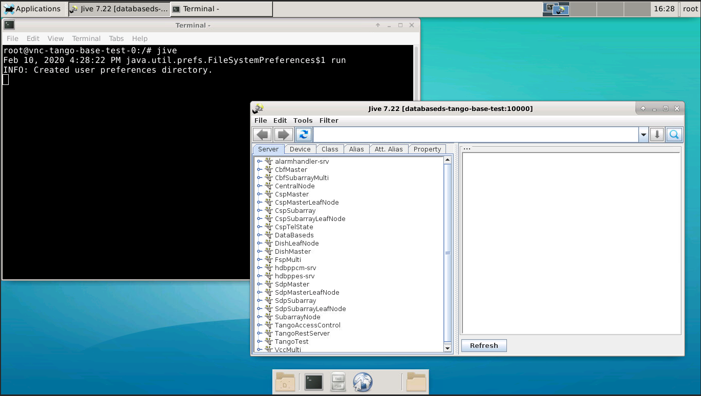

Running X based application on SKAMPI
=====================================

The X Window System is basically a client-server application that allow to display graphical content (i.e. window). In order to allow a container inside the k8s cluster to display GUI we need to reference of the X server. This means that we need to send the X authority file (environment variable XAUTHORITY) for authentication and the address of the server for the communication (environment variable DISPLAY). The latter parameter contains also the indication of the port of the server (if 0, the port is 6000, if 1 the port is 6001 and so on). 
Unfortunately the `engageska cluster <https://developerskatelescopeorg.readthedocs.io/en/latest/services/ait_performance_env.html#engageska-cluster>`_ does not allow that one of its servers connects outside the internal network at those ports.

OPTION #1
---------
To avoid the problem, it is possible to use ssh and the X option enabled to connect the engage machine sharing the socket for the X manager of the initial machine (laptop). There are few other options to set that has been included in the `deploy_tangoenv playbook <https://gitlab.com/ska-telescope/ansible-playbooks#ansibleplaybook>`_.
The tango-base chart is already equipped with the possibility to pass the XAUTHORITY and DISPLAY parameters. The following is an example code to display jive:

.. code-block:: console

    ssh -X -i ~/cloud.key ubuntu@192.168.93.24
    git clone https://gitlab.com/ska-telescope/skampi.git
    cd skampi
    make deploy KUBE_NAMESPACE=integration XAUTHORITY=~/.Xauthority DISPLAY=192.168.100.28:10

Note that the IP address 192.168.93.24 is the floating ip while the 192.168.100.28 is the internal private ip address. The number 10 comes from the DISPLAY variable created by ssh. 

OPTION #2
---------
It is possible to enable some tango java applications just exposing few services of the k8s cluster. This is the case of the hdb++ viewer where the exposed services are the archiverdb and the databaseds. In specific, it is possible to work with it exporting the following environment variables:

.. code-block:: console

    HDB_MYSQL_HOST=192.168.93.47
    HDB_MYSQL_PORT=32642
    HDB_NAME=hdbpp
    HDB_PASSWORD=tango
    HDB_TYPE=mysql
    HDB_USER=tango
    TANGO_HOST=192.168.93.47:32164

The port number for the archiver db (HDB_MYSQL_HOST) and for the tango database ds (TANGO_HOST) can be found looking at the `deploy_all <https://gitlab.com/ska-telescope/skampi/-/jobs/431836031#L385>`_ output: 

.. code-block:: console

    service/archiverdb-archiver-test           NodePort    10.100.123.58    <none>        3306:32370/TCP                      10h
    service/databaseds-tango-base-test         NodePort    10.97.60.174     <none>        10000:31088/TCP                     10h

OPTION #3
---------
The X Window System can also be installed into the container itself using a virtual screen. For this purpose it has been developed a docker image called tango-vnc `dockerfile <https://gitlab.com/ska-telescope/ska-docker/tree/master/docker/tango/tango-vnc>`_ to enable `vnc <https://www.realvnc.com/>`_ and no `vnc <https://novnc.com/>`_. It is possible to test this possibility in the pipeline machine at the following link: http://192.168.93.47:31955/vnc.html where the port number (31955) can be found in the `deploy_all <https://gitlab.com/ska-telescope/skampi/-/jobs/431836031#L385>`_ output: 

.. code-block:: console

    service/vnc-tango-base-test                NodePort    10.102.239.60    <none>        5920:30040/TCP,6081:31955/TCP       10h

Please request the password to the system team. 
Once inside the container, it is possible to open jive with a new terminal window as shown in the figure below. 

