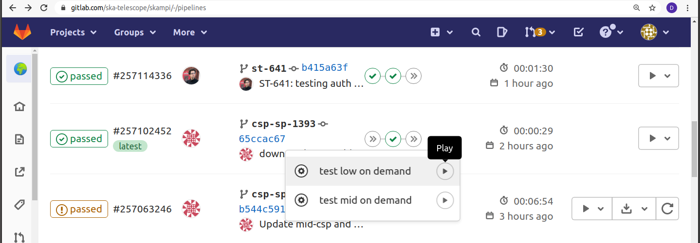

.. _`Multitenancy`:

Multitenant testing of SKAMPI on Kubernetes
*******************************************

The Kubernetes Clusters managed by the System Team are multitenant, which means that they can host multiple deployments of SKAMPI at the same time without affecting their individual performance. Those clusters are thus configured to ensure that each SKAMPI job runs isolated from the others and that the cluster resources are fairly allocated among the different jobs.  Isolation on the Kubernetes Clusters is implemented by deploying to a different Namespace.

Multitenancy is implemented for SKAMPI not only in the *permanent* Integration and Staging environments, but also on the temporary Pipeline environments and this has important implications for feature branch development. 
 
Kubernetes access to feature branch development namespaces
==========================================================

SKAMPI is reaching a status where the resources needed in terms of CPU and memory are such that developers will not be able to simulate the target environment by using, for example, a Minikube cluster running on their local machines. The Pipeline Testing environment allows users to treat it as a Development environment. Pipeline Testing includes the following features:

* Standard naming conventions allowing for a Namespace per development branch.
* The same Resource Quotas and Limit Ranges as those that are applied to Staging and Integration environments.
* Access to the temporary branch-based Namespace within the Kubernetes Cluster provided through a customized ``kubectl`` file.

.. warning::

   Branch-based deployments are complete deployments of MID or LOW, and therefore require the same resources as any other deployment of SKAMPI - developers should be mindful of the impact of deployments. As such branch-based namespaces are short lived: they are deleted 2 hours after their deployment, and only manually deployed for persistence - automatic deployments will be deleted immediately.

Pipeline Namespaces
-------------------

For SKAMPI Gitlab CI pipeline testing Kubernetes Namespaces are named automatically and as such users must be aware of the naming scheme. The name for the pipeline Namespace is of the form ``ci-<project name>-<branch name>``. For SKAMPI a ``-low`` or a ``-mid`` is appended at the end of the name depending on the telescope. For example, for a SKAMPI project branch named *at-51* and for a deployment involving  the MID telescope the corresponding Namespace name would be ``ci-skampi-at-51-mid``. We note that it is important to keep branch names reasonably short since Kubernetes truncates Resource names at 63 characters. 

It is also very important to follow strict **RFC 1123 naming conventions** since we will be using the Namespace name in many resources. Those conventions are enforced in our project settings. Branch names should not contain uppercase letters nor simbols other than ``-``. For example, if you try to name your development branch  *AT-51_test* a ``push`` to the SKAMPI repository will give the following error message:

::

 remote: GitLab: Branch name does not follow the pattern '^[a-z0-9]([-a-z0-9]*[a-z0-9])?$'
 To https://gitlab.com/ska-telescope/skampi.git
 ! [remote rejected]   AT-51_ test -> AT-51_ test (pre-receive hook declined)
 error: failed to push some refs to 'https://gitlab.com/ska-telescope/skampi.git'

There are two issues with this branch name: upper case letters and the underscore character. The branch should be renamed *at-51-test*.

.. note::

    It is important for users to develop appropriately for the multitenant environment. The  Helm Charts used for deploying SKAMPI should avoid accessing resources such as Ingresses, PersistentVolumes, and CustomResourceDefinitions in other namespaces. Cluster globals should also be avoided, for example ingress hostnames should be globally unique. This can be achieved by including the namespace designation in the URL.

    ``url: "http://$INGRESS_HOST/ci-$CI_PROJECT_NAME/taranta"`` is not multitenant, all namespaces     would share the same url.
    ``url: "http://$INGRESS_HOST/ci-$CI_PROJECT_NAME-$CI_COMMIT_BRANCH-mid/taranta"`` insures multitenancy.

Retrieving the kubectl file
---------------------------

Multitenancy of the branch pipelines allows for the owners of a given CI Pipline run to access logs, investigate problems, test things, without worrying that the performance of other jobs running in the cluster is affected. In order to achieve this users need to be able to retrieve a kubeconfig file giving access to the cluster. Such a file is generated automatically by the pipelines running on SKAMPI  providing access only to the namespace specific for that pipeline, thus assuring that users will not interfere with other jobs running in the cluster.

Retrieving the kubeconfig file is easy. Deployment and testing of SKAMPI in the pipeline Namespace are done manually, so the first step is to start a test. Go to pipeline output screen on Gitlab and select a test on the telescope of your choice. 

Next check the logs on Gitlab for that job. You'll see a ``curl`` in the job output towards the end:

::

 Example:
 
 You can get the kubeconfig file from the url: 
 "https://nexus.engageska-portugal.pt/repository/k8s-ci-creds/ci-skampi-st-559-publish-credentials-low" 
 with the following command into your current directory in a file called KUBECONFIG:
	curl https://nexus.engageska-portugal.pt/repository/k8s-ci-creds/ci-skampi-st-559-publish-credentials-low --output KUBECONFIG

Once this file is copied to your local machine, and the adequate enviroment variables are set you should be able to access the namespace within the kubernetes cluster. 

.. note::

  The namespaces are deleted if there is a more recent commit on the branch. To recreate the namespace you then need to launch a test on the pipeline associated with that commit. 

  The namespaces are also deleted 2 hours after they are created hence the kubeconfig is only valid for 2 hours.

Branch names and access patterns
================================

From the namespace pattern, a URL can be formed for accessing Webjive / Jupyter / Tango REST interface. For instance, if you branch name is *st-605* and you are running the tests for SKA MID telescope:

* Webjive: https://k8s.stfc.skao.int/ci-skampi-st-605-mid/taranta/devices
        * which comes from: <hostname>/ci-skampi-<branch>-mid/taranta/devices
* Jupyter: https://k8s.stfc.skao.int/ci-skampi-st-605-mid/jupyter
        * which comes from: <hostname>/ci-skampi-<branch>-mid/jupyter
* TANGO REST interface: https://k8s.stfc.skao.int/ci-skampi-st-605-mid/tango/rest/rc4/hosts/databaseds-tango-base-test-st-605/10000
        * which comes from understanding the TANGO REST interface - refer to the documentation.

For any deployment of SKAMPI, there is also now a start page from which most the above resources can be reached, at https://k8s.stfc.skao.int/ci-skampi-<branch>-mid/start and https://k8s.stfc.skao.int/ci-skampi-<branch>-low/start/.

If you replace the `ci-skampi-<branch>` part with `staging` or `integration`, you will reach the Staging and latest Integration deployments (based on the master branch) respectively.
