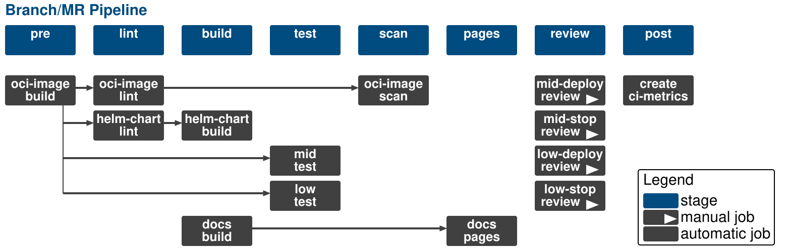
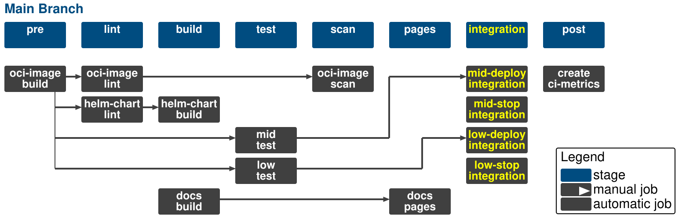

.. _pipelines_main:

SKAMPI Pipelines
****************

This section focus on deploying the SKAMPI suite of software products for testing and integration using the Gitlab CI Pipelines. If you have enough resources it is possible to deploy the MVP locally or on a dedicated server using a minikube installation compatible with SKAMPI like the one available from |SKA Minikube Deployment|. Nonetheless Gitlab CI pipelines is the recommended method since SKAMPI and its components are being actively developed, and can change rapidly. Those changes and  everything else required to set up the environment is readily included in the Gitlab CI infrastructure. 

When dealing with the CI SKAMPI infrastructure it is important to distinguish between:

* Branch and Merge Request (MR) pipelines (development)
* Main Branch pipelines (integration)
* Tag pipelines (staging)

This is how the development pipelines look like: 

Pipelines will be using **needs** keyword to speed up development workflow and break-up unnecessary job dependencies between jobs. This means that stages here are for illustrative purposes and any job without any prior dependency, for example **docs-build**, will start as soon as pipeline starts.  

The first job in the diagram, **oci-image-build**, generates a OCI image using the SKAO Standard Pipeline Machinery. This is only done if there were changes in the **images/testing** folder. This image is then uploaded to the gitlab registry and used by the runners in the testing and linting jobs. Subsequent jobs should not install dependencies as they are in the image already. This does not affect the development workflow as the developers can easily upgrade/downgrade the dependencies in the oci-image.

The **mid-test** and **low-test** jobs run verification tests covering all components on both the MID and LOW telescopes. Developers must be aware that configuration of the tests should be provided only by Makefiles and that all jobs for MID and LOW should be aligned so that they look same except the configuration. Pipeline Variables, CI/CD Variables and command line options should not be used. The exception are GitLab's variables such as CI_COMMIT_SHA, but even for those there is a make target to set them as environment variables. Developers should note also that **requirements.txt** files should not be used, test dependencies are handled in the root **pyproject.toml** file. This pipeline is short lived. The test jobs deploys the charts in pipeline defined unique namespaces, run the tests directly on the runner pods eliminating overhead and enabling easy integration and then tears down the deployment on Kubernetes. In the Kubernetes Clusters maintained by the System Team branch namespaces are deleted after 2 hours to prevent failing branch pipelines to accumulate.

Review jobs are what in previous SKAMPI versions were called *on demand jobs.* They provide more granular control over deployment/testing/cleaning and are intended to facilitate solving issues with failing pipelines. Branch pipelines run in specific namespaces that are isolated from other namespaces in the cluster. This multitenancy of the branch pipelines means developers do not need need worrying that the performance of other jobs running in the cluster is affected while they investigate problems. In the output of the **mid-deploy** and **low-deploy** jobs users are provided with instructions on hot to retrieve a kubeconfig file giving access to the namespace specific for that pipeline. 

The overall picture for non-tagged pipelines running in the Main branch is the following

Stages and jobs are similar to development branch pipelines except for the review jobs that are replaced with integration jobs for MID and LOW. These new jobs in turn require the corresponding tests to pass. If this happens then the SKAMPY deployment in the integration namespace is updated. This is a long living  deployment.

Finally for the staging pipelines

.. image:: images/diagrama2.svg
   :align: center
   
The review and integration jobs are replaced with mid-deploy-staging and low-deploy-staging jobs. The jobs depend not only on the test jobs like in the integration environment, but also on the chart jobs, including a new publish-chart job. A changelog is also built. This is also a persistent deployment. Altough a deployment to staging should not be viewed as a release, updating staging is in general accompanied by a SKAMPI release.

SKAMPI Configuration
====================

The SKAMPI repository folder structure at the time of this documentation is the following

This follows standard SKAO practices: a charts folder, a test folder, an images folder, and a documentation folder. SKAO pipeline machinery can thus be used and the **.gitlab-ci.yml** file will include the following lines:

.. code-block:: yaml

  include:
    # Helm Charts
    - project: "ska-telescope/templates-repository"
      file: "gitlab-ci/includes/helm-chart.gitlab-ci.yml"

    # Docs - only build as stress tests use 'public'
    - project: "ska-telescope/templates-repository"
      file: "gitlab-ci/includes/docs-build.gitlab-ci.yml"

    # release steps
    - project: "ska-telescope/templates-repository"
      file: "gitlab-ci/includes/release.gitlab-ci.yml"

    # .post steps
    - project: "ska-telescope/templates-repository"
      file: "gitlab-ci/includes/finaliser.gitlab-ci.yml"

**[modify, we are missing oci]**

Nonetheless some customization is required. The **.gitlab/ci** folder incorporates the required templates to change from the default pipeline machinery jobs. These are also include in the **.gitlab-ci.yml** file:

.. code-block:: yaml

  include:
    # Common template components
    - local: "/.gitlab/ci/common.gitlab-ci.yml"
    
    # # All SKA Low stages
    - local: "/.gitlab/ci/ska-low.gitlab-ci.yml"
    
    # All SKA Mid stages
    - local: "/.gitlab/ci/ska-mid.gitlab-ci.yml"
    
    # Jobs to run on PSI Low
    - local: "/.gitlab/ci/psi-low.gitlab-ci.yml"

Configuration and the way SKAMPI pipelines will proceed is managed by different runner tags, 
**k8srunner-psi-low** for PSI-LOW deployments, **k8srunner** (the default) for STFC MID and STFC LOW. 

This is also true when selecting the telescopes. CI/CD is aligned in such a way that MID an LOW should be handled through configuration options only.
The **mid-test** job defined in **.gitlab/ci/ska-mid.gitlab-ci.yml** and the 
**low-test** job defined in **.gitlab/ci/ska-low.gitlab-ci.yml** differ only through the use of selecting "mid" or "low" in the CONFIG and
TEL keys when setting the variables.

Thus for **mid-test** we have

.. code-block:: yaml

  # mid merge blocking job - must pass for pipeline success
  mid-test:
    stage: test
    variables:
      CONFIG: mid
      DEPLOYMENT_CONFIGURATION: "ska-$CONFIG"
      K8S_CHART: "$DEPLOYMENT_CONFIGURATION"
      HELM_RELEASE: "test-$CONFIG-$CI_JOB_ID"
      KUBE_NAMESPACE: "ci-$CI_PROJECT_NAME-$CI_JOB_ID-$CONFIG"
      KUBE_NAMESPACE_SDP: "ci-$CI_PROJECT_NAME-$CI_JOB_ID-$CONFIG-sdp"
      SERVICE_ACCOUNT: "ci-svc-$CI_PROJECT_NAME-$CI_JOB_ID"
      ARCHIVER_DBNAME: "$CI_JOB_ID-$CONFIG_archiver_db"
      COUNT: 1
      DISABLE_MAINTAIN_ON: "True"
      TEST_ENV: "BUILD_OUT"
      TEL: mid
      [... more code]

and for **low-test** job

.. code-block:: yaml

  low-test:
    stage: test
    variables:
      CONFIG: low
      DEPLOYMENT_CONFIGURATION: "ska-$CONFIG"
      K8S_CHART: "$DEPLOYMENT_CONFIGURATION"
      HELM_RELEASE: "test-$CONFIG-$CI_JOB_ID"
      KUBE_NAMESPACE: "ci-$CI_PROJECT_NAME-$CI_JOB_ID-$CONFIG"
      KUBE_NAMESPACE_SDP: "ci-$CI_PROJECT_NAME-$CI_JOB_ID-$CONFIG-sdp"
      SERVICE_ACCOUNT: "ci-svc-$CI_PROJECT_NAME-$CI_JOB_ID"
      ARCHIVER_DBNAME: "$CI_JOB_ID-$CONFIG_archiver_db"
      DISABLE_MAINTAIN_ON: "True"
      TEST_ENV: "BUILD_OUT"
      COUNT: 1
      TEL: low
      [... more code]

Only those two keys differ in the jobs. Developers are urged to maintain this similarity between jobs. Pipelines and tests should behave same: the System Under Test and Test Environment both should be idempotent and reproducible.

.. |SKA Minikube Deployment| raw:: html

       <a href="https://gitlab.com/ska-telescope/sdi/ska-cicd-deploy-minikube/" target="_blank">SKA Minikube Deployment</a>

 

