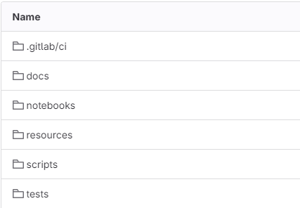

.. _pipelines_main:

SKAMPI Test Pipelines
*********************

.. note::
    Information regarding **deployment** pipelines has been moved to `ska-skampi-deployment <https://developer.skao.int/projects/ska-skampi-deployment/en/latest/pipelines.html>`_.

This section focuses on **testing** pipeline for the SKAMPI suite of software products using the Gitlab CI Pipelines.

The first step into testing SKAMPI is to actually deploy it. You can follow the link above to know more about it. Also, both the deployment and testing of SKAMPI are meant to be supported in remote and local environments. If you have enough resources, you can setup your own Kubernetes cluster follwing the `Minikube deployment <https://gitlab.com/ska-telescope/sdi/ska-cicd-deploy-minikube/>`_ instructions. Bear in mind that Gitlab CI pipelines is the recommended method since the deployment is usually faster and the clusters are configured to support SKAMPI requirements.

When dealing with the CI SKAMPI infrastructure it is important to distinguish between:

* Branch and Merge Request (MR) pipelines (development)
* Main Branch pipelines (integration)
* Tag pipelines (publishing and staging)

The development pipelines uses the main pipeline in this repository to trigger tests targetting a test environment. As mentioned before, the deployment and testing of SKAMPI was split. This was done to facilitate the development-test cycle, as now developers can run multiple tests against a living environment, which will facilitate debugging of SKAMPI issues.

Depending on the contents of the tests, users can also trigger test pipelines in integration and staging environments, to quickly assess the overall health of the deployed system. If doing so, take consideration that the selected tests should not reconfigure the deployed components in a way that is destructive for other (even simultaneous) operations, as these can be long-lived environments.

SKAMPI Tests Configuration
==========================

The SKAMPI repository folder structure at the time of this documentation is the following:

|

This follows standard SKAO practices: a **notebooks** folder, a **tests** folder, and a documentation folder, along with other non-standard resources. SKAO pipeline machinery can thus be used and the **.gitlab-ci.yml** file will include the following:

.. code-block:: yaml

  include:
    # Linting
    - project: "ska-telescope/templates-repository"
      file: "gitlab-ci/includes/python-lint.gitlab-ci.yml"
    - project: "ska-telescope/templates-repository"
      file: "gitlab-ci/includes/notebook-lint.gitlab-ci.yml"

    # Tests
    - local: "/.gitlab/ci/test.gitlab-ci.yml"

    # Docs - only build as stress tests use 'public'
    - project: "ska-telescope/templates-repository"
      file: "gitlab-ci/includes/docs-build.gitlab-ci.yml"

    # .post steps
    - project: "ska-telescope/templates-repository"
      file: "gitlab-ci/includes/finaliser.gitlab-ci.yml"

Nonetheless some customizations are required. The **.gitlab/ci** folder incorporates the required templates to change the behaviour default pipeline machinery jobs. These were also included in the **.gitlab-ci.yml** file:

.. code-block:: yaml

    # Tests
    - local: "/.gitlab/ci/test.gitlab-ci.yml"

This introduces the pipeline to run tests targetting a SKAMPI deployment. Currently, we have the following test jobs:

* **test-low** - Run tests on the **STFC cluster** targetting a LOW deployment
* **test-mid** - Run tests on the **STFC cluster** targetting a MID deployment
* **test-low-dp** - Run tests on the **STFC DP cluster** targetting a LOW deployment
* **test-mid-dp** - Run tests on the **STFC DP cluster** targetting a MID deployment

These jobs exist so that we can run tests using particular runners and a particular telescope - mid or low. Now, one can run a test on either of these jobs manually, targetting **any** deployment. Any of these jobs runs the exact same code, and we can make use of the following environment variables:

* **KUBE_NAMESPACE** - Kubernetes namespace to target
* **CONFIG** - Telescope selection, **mid** or **low**
* **MARK** - Tests to run (by default runs the telescope tests)
* **PYTEST_MARK** - Expression to modify the tests that run by default(given `MARK`)
* **PYTEST_COUNT** - Number of times the tests will run

Make sure that you set the **secret** variables in the Makefile (preferably, in PrivateRules.mak):

* **TARANTA_PASSWORD**
* **JIRA_AUTH**
* **JIRA_PASSWORD**
* **CAR_RAW_PASSWORD**
* **ARCHIVER_PWD**

Note that not all of this variables are required. Other variables, like `KUBE_NAMESPACE_SDP`, `TANGO_HOST` or `HELM_RELEASE` are automatically generated by the Makefile. There are other variables we can set to modify the tests procedures. To know more about those, take a look at the `README.md <https://gitlab.com/ska-telescope/ska-skampi/-/blob/master/README.md#deploy-via-skampi>`_ and the `Makefile <https://gitlab.com/ska-telescope/ska-skampi/-/blob/master/Makefile>`_ of the project.

This streamlining of the pipelines makes sure that we have stable inputs to the testing pipelines. New jobs might be added in the future to allow other clusters' environments to be tested.
