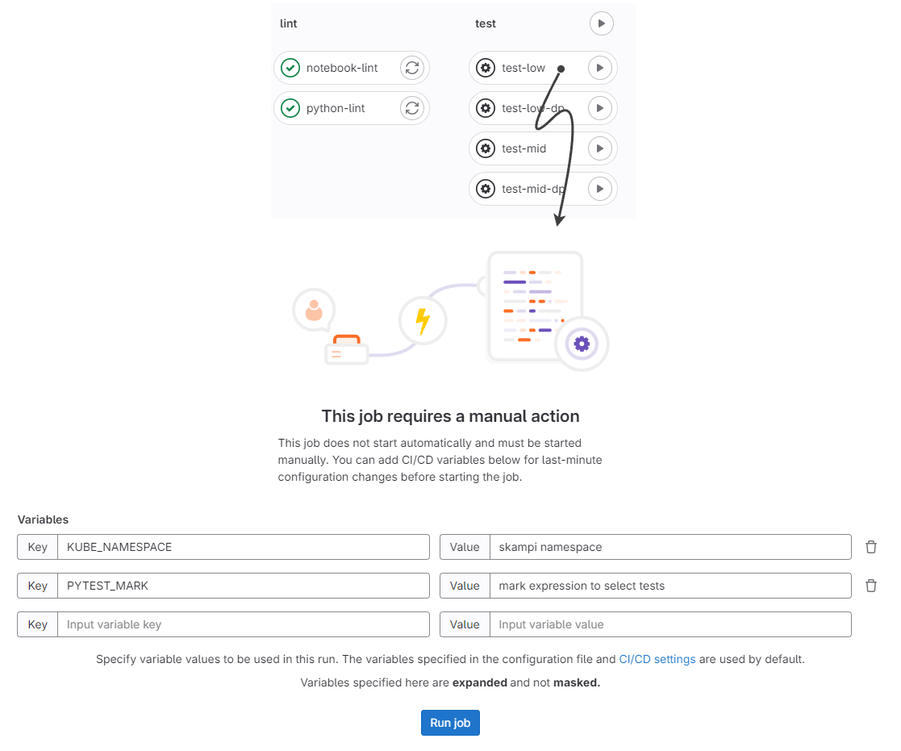

.. _testing_main:

SKAMPI Testing
**************

When it comes to deployments, please refer to `ska-skampi-deployment <https://developer.skao.int/projects/ska-skampi-deployment/en/latest/index.html>`_ for detailed information. In short, all we need is a functional Kubernetes cluster (with auxiliary components like metallb, externalDNS, SKA Tango Operator, etc) to deploy SKAMPI into and run tests. 

.. note::
   To create a cluster locally (or even in a remote machine), please follow the `Minikube deployment <https://gitlab.com/ska-telescope/sdi/ska-cicd-deploy-minikube/>`_ instructions.

Running tests in CI/CD pipelines (as shown below), might not be that interactive, but it is much easier to setup, minding the fact that using pipelines can only be done when targetting SKA **managed** clusters. Another way of running in-cluster tests in a more interactive way, is to use **Binderhub**, although this method still requires a valid **kubeconfig**.

Running tests in CI/CD pipelines
################################

To avoid access requirements and all of the local setup, when testing **remote** clusters, we should use the CI/CD pipelines. To know in detail what job to select and what variables are available, please refer to `:ref:_pipelines_main`.

To trigger a test, you can simply trigger a pipeline of your desired branch in ska-skampi, and run the test job that you require.

After setting the required (**KUBE_NAMESPACE** is the only required variable), you simply click **Run job** to run the tests.

Running tests locally
#####################

To run tests locally, targetting any existing cluster, we need to make sure the following pre-conditions are met:

* Valid **Kubeconfig** for the cluster and namespaces of interest
* The ability to resolve the service FQDNS (i.e., databaseds-tango-base.ci-skampi-namespace.svc.cluster.local)
   * If using a remote cluster, connect to the matching VPN
* **Python** and **poetry** installed
* **kubectl**, **helm** (and optionally k9s) installed

.. note::
   Regardless of the cluster, the access is done using a Kubeconfig - that grants and scopes the access you have to a Kubernetes cluster.For a remote cluster, you might not have a Kubeconfig file to use, due to access restrictions. Although, in SKAMPI, every **on-demand** deployment creates and exposes a valid Kubeconfig. For that, look for "Generate Kubernetes credentials" within the logs of the deployment pipelines. You download that to you local machine, and interact with the SKAMPI namespaces.

Afterwards, we can setup the local environment:

.. code-block:: bash

   poetry shell
   poetry install

Now, we configure and validate the access to the Kubernetes cluster:

.. code-block:: bash

   export KUBECONFIG=<path to the kubeconfig of choice>
   export KUBE_NAMESPACE=<skampi namespace>
   export KUBE_NAMESPACE_SDP=$KUBE_NAMESPACE-sdp
   kubectl describe ns -n $KUBE_NAMESPACE
   kubectl describe ns -n $KUBE_NAMESPACE_SDP

Finally, we can selectively run the tests (by defining `PYTEST_MARK`) targetting the environment, as follows:

.. code-block:: bash

   # Example for PYTEST_MARK: "(csp_startup or eda)"
   # KUBE_NAMESPACE was exported above
   CONFIG=<mid or low> PYTEST_MARK=<mark selecting tests of your choice> make k8s-test-runner

This setup replicates the CI/CD jobs in what running the tests concerns.

.. note::
   To create a cluster locally (or even in a remote machine), please follow the `Minikube deployment <https://gitlab.com/ska-telescope/sdi/ska-cicd-deploy-minikube/>`_ instructions.

SKAMPI Binderhub
================

If you navigate to `Binderhub <https://k8s.stfc.skao.int/binderhub/>`_ or `Binderhub DP <https://sdhp.stfc.skao.int/binderhub/>`_, depending on where your deployment is, you can now open this repository in Binderhub, with its custom image. It brings all of the Kubernetes interaction tools (i.e., **kubectl**, **helm** and even **k9s**), as well as the **notebooks**, along with pre-installed python dependencies for testing.

You also have access to the terminal, with **git** installed, if you ever need to commit changes from Binderhub.

To be able to run tests, we also need a **Kubeconfig**, that we can get from the SKAMPI pipelines. To set it up, you can:

.. code-block:: bash

   mkdir -p ~/.kube
   curl -L <url of artefact.skao.int with the kubeconfig> -o ~/.kube/config
   kubectl get pods

Afterwards, we can run the tests from the Binderhub pod:

.. code-block:: bash

   export KUBE_NAMESPACE=<skampi namespace>
   export KUBE_NAMESPACE_SDP=$KUBE_NAMESPACE-sdp
   CONFIG=<mid or low> PYTEST_MARK=<mark selecting tests of your choice> make k8s-test-runner

.. toctree::
   :maxdepth: 2

   testing/skampi_fixtures

