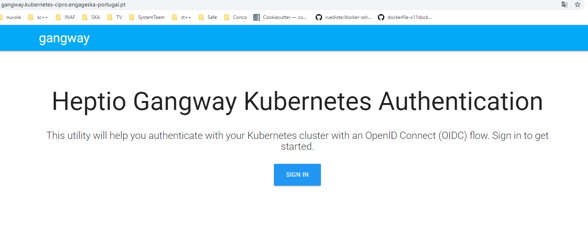
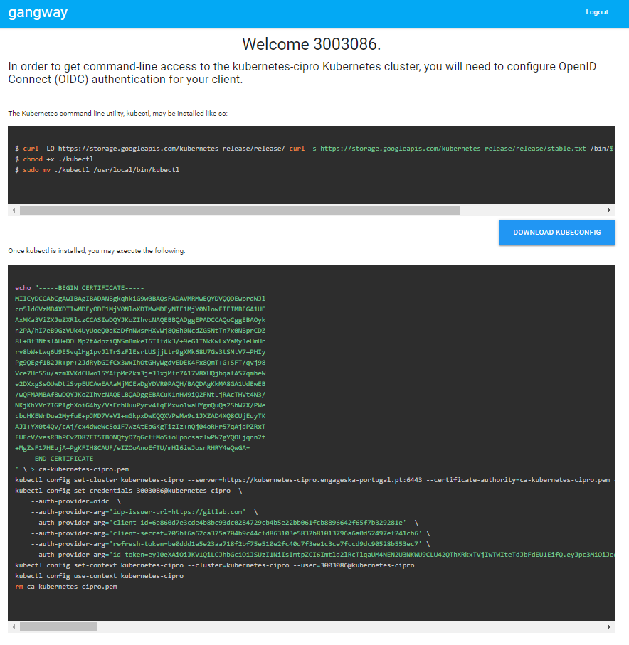
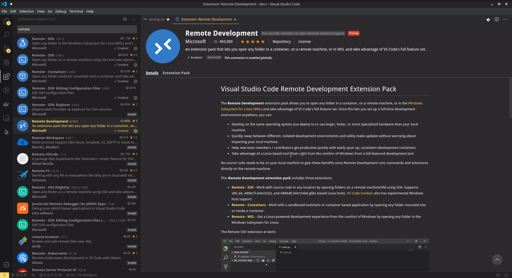
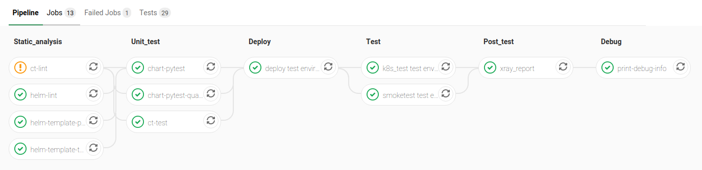
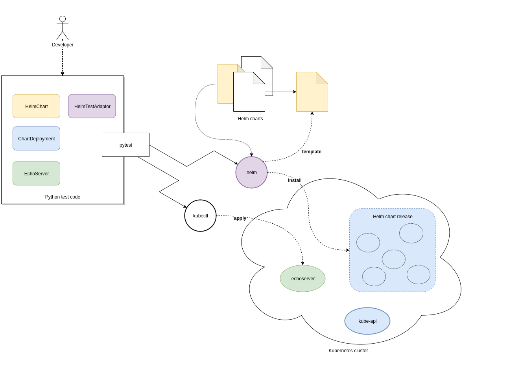
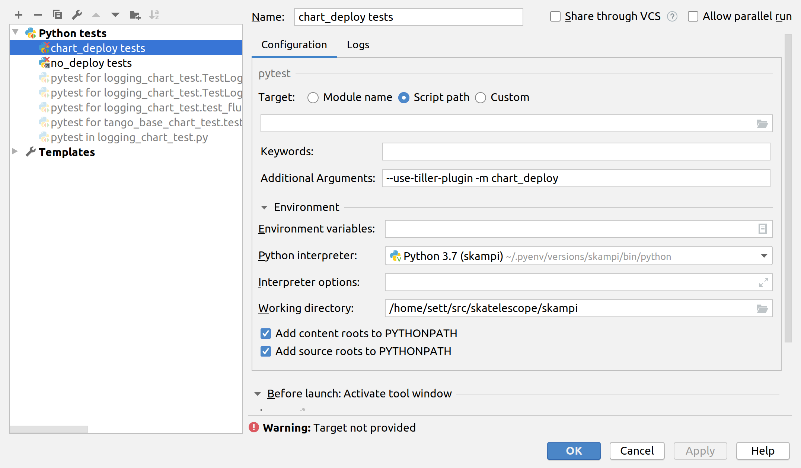
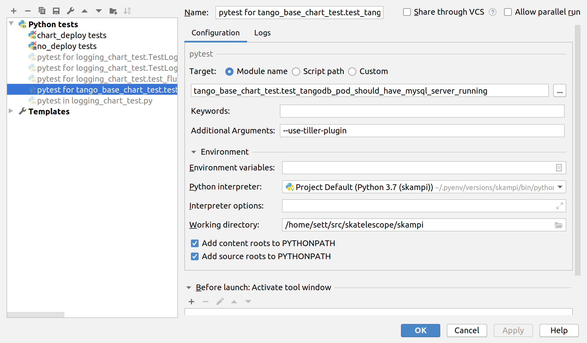

Testing SKAMPI 
==============
The SKA MPI codebase ultimately holds all the information required to deploy and configure the complete prototype.
This information is encapsulated as a collection of `Helm <https://helm.sh/>`_ charts, Makefiles and any other
scripts, components to support its test and deployment.

This page outlines the various categories of testing and approaches one can employ to test various aspects of SKA MPI prototype that can
be implemented in this repository.

Minikube Testing Environment - EngageSKA Openstack
--------------------------------------------------

Minikube is a tool that makes it easy to run Kubernetes locally. Minikube runs a single-node Kubernetes cluster 
inside a Virtual Machine (VM) in Openstack.

Create a Virtual Machine
^^^^^^^^^^^^^^^^^^^^^^^^

The first step is to create a Virtual Machine in EngageSKA Openstack: 
https://developerskatelescopeorg.readthedocs.io/en/latest/services/ait_performance_env.html. 
The recommended specifications are:

- Volume Size: 100 GB
- Image: Ubuntu 18.04 LTS Jan/2020
- Flavor: m2.small

Don't forget to associate your public key or generate a new key pair in the ``Key Pair`` section.

Next, go to the ``Instances`` section and create a new floating IP (dropdown on the right).  

Create and test the environment
^^^^^^^^^^^^^^^^^^^^^^^^^^^^^^^

Install ansible inside the VM and run the ansible-playbooks for creating 
a development environment and the SHAMPI environment:

.. code-block:: bash

    # Install Ansible
    sudo apt-add-repository --yes --update ppa:ansible/ansible && sudo apt-get install ansible
    # Create Environment
    git clone https://gitlab.com/ska-telescope/ansible-playbooks.git
    cd ansible-playbooks
    ansible-playbook -i hosts deploy_tangoenv.yml
    ansible-playbook -i hosts deploy_skampi.yml

Verify if everything is running using ``kubectl get services -n integration``:

.. code-block:: bash

    NAME                               TYPE        CLUSTER-IP       EXTERNAL-IP   PORT(S)                             AGE
    archiverdb-archiver-test           NodePort    10.96.233.41     <none>        3306:31305/TCP                      5m27s
    databaseds-tango-base-test         NodePort    10.105.145.228   <none>        10000:30897/TCP                     5m24s
    elastic-logging-test               NodePort    10.103.79.41     <none>        9200:31976/TCP                      5m26s
    etcd-restore-operator              ClusterIP   10.100.7.96      <none>        19999/TCP                           5m28s
    jupyter-oet-test                   NodePort    10.105.61.127    <none>        8888:32025/TCP                      5m26s
    kibana-logging-integration-test    ClusterIP   10.102.79.54     <none>        5601/TCP                            5m26s
    mongodb-webjive-test               ClusterIP   None             <none>        27017/TCP                           5m23s
    rest-oet-test                      ClusterIP   None             <none>        5000/TCP                            5m25s
    ssh-oet-test                       NodePort    10.97.46.250     <none>        22:30520/TCP                        5m25s
    tango-rest-tango-base-test         NodePort    10.99.6.220      <none>        8080:32490/TCP                      5m24s
    tangodb-tango-base-test            NodePort    10.103.4.193     <none>        3306:31154/TCP                      5m24s
    test-sdp-prototype-etcd            ClusterIP   None             <none>        2379/TCP,2380/TCP                   3m18s
    test-sdp-prototype-etcd-client     ClusterIP   10.107.155.120   <none>        2379/TCP                            3m18s
    test-sdp-prototype-etcd-nodeport   NodePort    10.107.127.158   <none>        2379:30456/TCP                      5m25s
    vnc-tango-base-test                NodePort    10.108.131.141   <none>        5920:30658/TCP,6081:30662/TCP       5m24s
    vscode-tango-base-test             NodePort    10.107.133.184   <none>        22:31214/TCP                        5m24s
    webjive-webjive-test               ClusterIP   10.111.102.81    <none>        80/TCP,5004/TCP,3012/TCP,8080/TCP   5m23s

The next step is to reboot the system with ``sudo reboot`` and then ssh again into the VM.

Finally, download the SKAMPI repository and run the test in minikube:

.. code-block:: bash

    #Remove the existing skampi directory
    sudo rm -rd skampi/
    # Download and run test
    git clone https://gitlab.com/ska-telescope/skampi.git
    cd ansible-playbooks
    ansible-playbook deploy_minikube.yml 
    cd .. 
    cd skampi/
    make deploy_all KUBE_NAMESPACE=integration

Kubernetes Testing Environments
------------------------------
At the moment 3 k8s multi-node clusters are available for testing purpose: 

+--------------------------+-----------------------------------------------------------------------------------------------------------+
| Cluster name             | Information                                                                                               |
+==========================+===========================================================================================================+
| *engageska-k8s-master*   | - 1 master, 4 worker nodes                                                                                |
|                          | - working in the skampi pipeline                                                                          |
|                          | - A&A not available                                                                                       |
+--------------------------+-----------------------------------------------------------------------------------------------------------+
| *engageska-k8s-v2*       | - 1 master, 2 worker nodes                                                                                |
|                          | - working in the skampi pipeline                                                                          |
|                          | - A&A available. To work with it the file /etc/hosts has to be modified with the following lines:         |
|                          | .. code-block:: bash                                                                                      |
|                          |                                                                                                           |
|                          |      192.168.93.46	gangway.kubernetes-v2.engageska-portugal.pt                                            |
|                          |                                                                                                           |
+--------------------------+-----------------------------------------------------------------------------------------------------------+
| *kubernetes-cipro*       | - 1 master, 2 worker nodes                                                                                |
|                          | - not working in the skampi pipeline                                                                      |
|                          | - A&A available. To work with it the file /etc/hosts has to be modified with the following lines:         |
|                          | .. code-block:: bash                                                                                      |
|                          |                                                                                                           |
|                          |      192.168.93.46	gangway.kubernetes-cipro.engageska-portugal.pt                                         |
|                          |                                                                                                           |
+--------------------------+-----------------------------------------------------------------------------------------------------------+

Kubectl setup
^^^^^^^^^^^^^

If a cluster has the A&A module enabled it is possible to generate the instructions to let the local kubectl work with it. In order To do that, once modified the file /etc/hosts as explained above, open the [gangway](https://github.com/heptiolabs/gangway) url for `engageska-k8s-v2 <http://gangway.kubernetes-v2.engageska-portugal.pt>`_ or `kubernetes-cipro <http://gangway.kubernetes-cipro.engageska-portugal.pt >`_.
The *Sign In* button will redirect to gitlab.com for authentication. Once authenticated it will appear the set of commands to setup the local kubectl as shown below. 

The following namespaces are available for use: "integration", "sdp", "csp", "button", "ncra", "karoo". For creating new namespaces or for any authorization request, contact the system team.

Visual Studio Code Remote Access
--------------------------------

Visual Studio Code Remote Development allows you to use a container, remote machine, or the Windows Subsystem for Linux (WSL) as a 
full-featured development environment.

No source code needs to be on your local machine. Each extension in the Remote Development extension pack can run commands 
and other extensions directly inside a container, in WSL, or on a remote machine so that everything feels like it does when you run locally.

.. image:: _static/img/architecture.png 
    :alt: SKAMPI Gitlab CI pipeline

Install Extension
^^^^^^^^^^^^^^^^^
Before everything, we need to install the Remote Development extension from vscode.

Create SSH connection
^^^^^^^^^^^^^^^^^^^^^^

On vscode, open the ``Remote-SSH: Open Configuration File...``, copy and paste these properties:

.. code-block:: bash

    Host connection-name         # connection-name -> name of your connection, give any name you want
        HostName IP              # IP -> VM's floating IP 
        User ubuntu

Finally, with the command ``ssh connection-name`` starts the ssh connection.

Connect to Openstack VM - Option 1
^^^^^^^^^^^^^^^^^^^^^^^^^^^^^^^^^^^^^^^^^^^^^^^
After you created a new ssh connection on your local machine: `Create SSH connection`_.

After this, launch the remote extension inside vscode (bottom left icon or use the shortcut ``ctrl+shift+P``) 
and select ``Remote-SSH: Connect to Host...`` and select the ``connection-name`` you previously created.

Connect to Kubernetes - Option 2
^^^^^^^^^^^^^^^^^^^^^^^^^^^^^^^

The tango-base chart available in the skampi repository defines an ssh service which can be used within the vscode extension. The service is deployed in the same IP as the host machine and the port can be discovered with the command ``kubectl get services -n integration`` which will give you the following output:

.. code-block:: bash

    kubectl get services -n integration
    NAME                               TYPE        CLUSTER-IP       EXTERNAL-IP   PORT(S)                             AGE
    ...
    vscode-tango-base-test             NodePort    10.107.133.184   <none>        22:*PORT*/TCP                        5m24s
    ...

Create new ssh connection on your local machine: `Create SSH connection`_.
But with this configuration parameters:

.. code-block:: bash

    Host connection-name          # connection_name -> name of your connection, give any name you want
        HostName IP               # IP -> VM's floating IP 
        Port port                 # port-> vscode server port
        User tango

After this, launch the remote extension inside vscode (bottom left icon or use the shortcut ``ctrl+shift+P``) 
and select ``Remote-SSH: Connect to Host...`` and select the ``connection-name`` you previously created.
Please request the password to the system team. 

Testing Infrastructure as Code
------------------------------
There is a substantial amount of infrastructure and its constituent parts (e.g. Kubernetes resources and their
configuration) that forms part of The Telescope. This configuration is orthogonal to the functionality of the
software components that are deployed, but changes to them can result in faults in deployment and operation of 
the system.

Testing at the appropriate level will ensure faster feedback of changes, reducing frustration for everyone and
ultimately improve the quality of the system. **Troubleshooting faults in a distributed system caused by
a typo in configuration is no fun!**

To support different levels of testing, various different jobs are executed as part of the SKAMPI build pipeline and
some `testware <https://en.wikipedia.org/wiki/Testware>`_ has been developed to aid in testing.

Pipeline Stages for Testing
^^^^^^^^^^^^^^^^^^^^^^^^^^^

The stages of the pipeline related to testing are outlined below:

+-------------------+------------------------------------------------------------------------------------------------------------------+
|       Stage       |                                                   Description                                                    |
+===================+==================================================================================================================+
| Static_analysis   | Tests aspects of charts that do not require their deployment, e.g. linting                                       |
+-------------------+------------------------------------------------------------------------------------------------------------------+
| Unit_test [unit]_ | Tests here might deploy them to an                                                                               |
|                   | `ephemeral test environment <https://pipelinedriven.org/article/ephemeral-environment-why-what-how-and-where>`_. |
+-------------------+------------------------------------------------------------------------------------------------------------------+
| Test              | Tests to be executed in-cluster alongside the fully deployed SKAMPI prototype.                                   |
+-------------------+------------------------------------------------------------------------------------------------------------------+

**SKAMPI Gitlab CI Pipeline** (as of January 2020):

Python testware
^^^^^^^^^^^^^^^
Some components have been developed to assist in testing the Helm charts using Python. They are intended to be 
used with `pytest <http://pytest.org/>`_ as a test runner and there are currently three jobs in the pipeline that 
are configured to executed them, filtered based on `pytest markers <https://docs.pytest.org/en/latest/example/markers.html>`_: 

Pipeline jobs
"""""""""""""
- *helm-template-pytest* runs as part of the *Static_analysis* stage in the pipeline executes Python tests marked 
  with ``no_deploy``.

- *chart-pytest* runs as part of the *Unit_test* stage and will execute tests marked with the ``chart_deploy`` 
  marker [unit]_.

- *chart-pytest-quarantine* also runs during the *Unit_test* stage and executes tests marked with ``quarantine`` 
  but do not fail the build if they do.

Pytest configuration
""""""""""""""""""""
As per convention, Pytest is will collect all tests placed in the ``/tests/`` directory. The following markers are
currently defined (see */pytest.ini* for more details):

``no_deploy``
    Indicates tests that will not require any resources to be deployed into a cluster. Generally, tests that
    parse and transform the source chart templates.

``chart_deploy``
    Indicates tests that requires resources to be deployed into cluster such as the Helm chart under test and
    any other collaborating testware.

``quarantine``
    Indicates tests that should be executed but not necessarily break the build. Should be used sparingly. 

The following custom command-line flags can be passed to Pytest:

``--test-namespace <namespace>``
    Specify the namespace to use in the test session. Defaults to ``ci``.

``--use-tiller-plugin``
    Indicates that all commands to Helm should be prefixed with ``helm tiller run --``. Required when using the 
    `helm-tiller plugin <https://github.com/rimusz/helm-tiller>`_.

Test lifecycle
""""""""""""""
The lifecycle (setup, execute, teardown) of tests are managed by pytest fixtures, defined in `/tests/conftest.py`.
The ``infratest_context`` fixture in particular will determine if tests that involve deployments are included in the
pytest run, i.e. the ``chart_deploy`` marker is included. It will then:

1. invoke **kubectl** to create a namespace for the test resources(pods, services, etc.) to be deployed into 
2. ensure this namespace is deleted after the test run

**Note**: the default namespace is ``ci``, but can be overriden by specifying the custom pytest option,
``--test-namespace``. When running inside the pipeline, this flag is set to ``ci-$CI_JOB_ID`` so each job will use
its own namespace and resources, ensuring test isolation.

Test support
""""""""""""

A collection of useful components and functions to assist in testing can be found in the ``tests.testsupport`` module
(*/tests/testsupport/*):

``testsupport.util``
    Functions that may be useful in testing such as `wait_until` which allows polling, retries and timeouts.

``testsupport.helm.HelmChart``
    Represents a Helm chart that is the collection of YAML template files and *not necessarily a set of deployed 
    Kubernetes resources*. Primarily used to assist in testing the policies in YAML specifications, i.e. ``no_deploy`` 
    tests.

``testsupport.helm.ChartDeployment``
    Represents a deployed Helm chart and offers access to its resources in-cluster their metadata (by querying the
    Kubernetes API server).

``testsupport.helm.HelmTestAdaptor``
    A rudimentary adaptor class to manage the interaction with the Helm CLI.

``testsupport.extras.EchoServer``
    Represents a pod that can be deployed alongside the chart under test, containing a basic Python HTTP server that
    can receive commands. Currently it only supports echoing any HTTP POST sent to the `/echo` path. A handle to this
    is provided by the `print_to_stdout` method.

Charts are deployed via Helm and the `HelmTestAdaptor`. It's available as a Pytest fixture or you can import it from
the ``tests.testsupport.helm`` module.

The ``ChartDeployment`` class is an abstraction to represent a deployed chart and offers access to its resources
in-cluster (by querying the Kubernetes API) and metadata (such as ``release_name``).

In fact, **instantiating a ChartDeployment in code will deploy the specified chart**. A useful pattern is to create
Pytest fixture that represents the chart to be deployed and yields a ``ChartDeployment`` object. It can also call
``.delete()`` to ensure the chart is deleted and Pytest fixture scope can be used to limit a chart's lifespan. For an
example of this see the ``tango_base_release`` fixture in */tests/tango_base_chart_test.py*.

The diagram below illustrates the relationship between the Python classes in test code, CLI tools and the cluster.

Running locally
"""""""""""""""
Requirements:

- A Kubernetes cluster (minikube).
- **kubectl** authorized to create namespaces and deploy resources to the cluster.
- **helm v3.0.2** 
- **Python 3.7+**

1. Install Python dependencies: ``pip install -r test-requirements.txt``
2. Execute only the ``no_deploy`` tests: ``pytest -m "no_deploy and not quarantine"``
3. Execute only the ``chart_deploy`` tests: ``pytest -m "chart_deploy and not quarantine"``
4. Execute the quarantined tests: ``pytest -m quarantine``

PyCharm integration
"""""""""""""""""""
PyCharm as an IDE can be used to run and debug the tests, just be sure to edit the Run/Debug configuration so that it
has the appropriate "Additional Arguments" and "Working Directory" (SKAMPI root directory and not */tests*).

Third-party libraries
"""""""""""""""""""""
The following third-party libraries are included in the `test-requirements.txt` and used by the tests and various
supporting testware components:

- `python kubernetes client <https://github.com/kubernetes-client/python>`_ is the official kubernetes API client for
  Python. It's provided as a pytest fixture, ``k8s_api`` and also used by ``ChartDeployment`` to obtain a list of deployed
  pods(see get_pods method).

- `testinfra <https://testinfra.readthedocs.io/en/latest/index.html>`_ is a library that allows connecting to pods
  and asserting on the state of various things inside them such as open ports, directory structure, user accounts, etc.

- `elasticsearch-py <https://elasticsearch-py.readthedocs.io/en/master>`_ is the official, low-level Python client for 
  ElasticSearch.

- `requests <http://python-requests.org/>`_ is the popular HTTP client library.

.. [unit] A unit in this context is a Helm chart that can be deployed and tested.