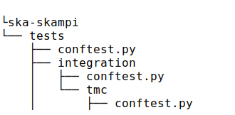

.. _`Testing Runway`:

Understanding SKAMPI Fixtures [Basic]
*************************************************************
**General Terms in SKAMPI tests:**

    **Entry Points:**

            The EntryPoint object provide the tester a high level API for commanding the SUT.More about this is explained in demoed example.
    
    **Composition:**
            Composition in tests generally refers to when we are assigning resources to a Subarray.
            
            The **standard_composition_template** in following source file can give more idea about this:
                * https://gitlab.com/ska-telescope/ska-ser-skallop/-/blob/master/src/ska_ser_skallop/mvp_control/configuration/composition.py
  
    **Configuration:**
            Configuration in tests refers when configuring a Subarray for scanning purpose.

            The **standard_configuration_template** in following source file can give more idea about this:
                * https://gitlab.com/ska-telescope/ska-ser-skallop/-/blob/master/src/ska_ser_skallop/mvp_control/configuration/configuration.py

    
**conftest.py**:
   This file used to define the fixture functions to make them accessible across multiple test files.

| Refer to ``tests/conftest.py``. 
| Refer to ``tests/integration/conftest.py``.
| Refer to ``tests/unit/conftest.py``.

**Conftest Priority**:
Consider one of the directory tree of SKAMPI:

| As you can see conftest.py is present at different levels of the directory and our tests are in tmc directory.

| Here the fixtures defined in the tests would be first searched in tmc directory.

| If not found it will be get searched in integration directory.

| If not found will be get searched in tests directory.

**Fixtures**: 

Most of the SKAMPI fixtures are defined at ska-ser-skallop repository:
    * https://gitlab.com/ska-telescope/ska-ser-skallop/-/tree/master/src/ska_ser_skallop/mvp_fixtures

A good documentation for fixtures used in SKAMPI is available at:
    * https://developer.skao.int/projects/ska-ser-skallop/en/latest/howto/use_skallop_fixtures.html?highlight=skallop

Below fixtures are taken from above link for example purpose:  

`fxt_types.allocated_subarray <https://gitlab.com/ska-telescope/ska-ser-skallop/-/blob/master/src/ska_ser_skallop/mvp_fixtures/fixtures.py>`_
 
* Generate a Subarray context object in the IDLE state with a set of resources assigned a fixture.

* SKA-SKAMPI Reference:  tests/integration/tmc/test_configure_scan.py

.. code-block:: python

    from ska_ser_skallop.mvp_fixtures.fixtures import fxt_types
    def fxt_disable_abort(allocated_subarray: fxt_types.allocated_subarray):
        allocated_subarray.disable_automatic_clear()
        allocated_subarray.disable_automatic_teardown()

`fxt_types.configured_subarray <https://gitlab.com/ska-telescope/ska-ser-skallop/-/blob/master/src/ska_ser_skallop/mvp_fixtures/fixtures.py>`_

* Returns a configured Subarray based on an existing Subarray instance created by a fixture.
  
* SKA-SKAMPI Reference:  tests/integration/tmc/test_scan.py

.. code-block:: python

    from ska_ser_skallop.mvp_fixtures.fixtures import fxt_types
    def the_sdp_subarray_must_be_in_the_scanning_state(
        configured_subarray: fxt_types.configured_subarray,
        context_monitoring: fxt_types.context_monitoring,
        integration_test_exec_settings: fxt_types.exec_settings,
    ):
    tmc_subarray_name = tel.tm.subarray(configured_subarray.id)

Below fixtures are referred from conftest.py:

`integration/conftest.py <https://gitlab.com/ska-telescope/ska-skampi/-/blob/master/tests/integration/conftest.py>`_ 

**pytest.fixture: sut_settings**:

        *   Fixture to use for setting env like  SUT settings for fixtures in conftest
        *   SKA-SKAMPI Reference: tests/integration/tmc/test_scan.py

.. code-block:: console

        169 	def the_sdp_csp_and_dish_must_be_on(sut_settings: conftest.SutTestSettings):
	181 		for index in range(1, sut_settings.nr_of_subarrays + 1):
	182 		subarray = con_config.get_device_proxy(tel.sdp.subarray(index))

`integration/tmc/conftest.py <https://gitlab.com/ska-telescope/ska-skampi/-/blob/master/tests/integration/tmc/conftest.py>`_ 

**pytest.fixture: base_configuration**:

        *  Setup a base scan configuration to use for SDP.
  
        *  SKA-SKAMPI Reference: tests/integration/tmc/

.. code-block:: console

        50 	    def fxt_default_composition(base_composition: conf_types.Composition):
	57 		return base_composition

|          

**Understanding Fixtures With an Example:**
-------------------------------------------
Information on BDD tests can be found at: https://developer.skao.int/en/latest/tools/bdd-test-context.html

Following is an example for Assigning Resources on SKA mid.

**Scenario:**

.. code-block:: console

    Scenario: Assign resources to mid subarray
		Given an TMC
		Given an telescope subarray
		When I assign resources to it
		Then the subarray must be in IDLE state

**Fixtures used in this scenario**: 
      **pytest fixtures** can be found in the test file or in conftest.py of tests directory.

      **fxt_types** fixtures are defined in: ska_ser_skallop/mvp_fixtures/fixtures.py

           * **pytest.fixture(name=composition):** A fixture for default composition. Here in the below example we are composing a Subarray through TMC entry point.
           * **pytest.fixture:(name=sut_settings):** A fixture for System Under Test. Information like Subarray ID, number of receptors, Scan duration, Number of Subarrays is passed. Customizable as they are defined in tests.
           * **fxt_types.running_telescope:** Fixture used to set a telescope into a running (ON) state. Gives running telescope devices. Gives the Subarray in an EMPY observation state.Which is needed or a must have condition/observation state for assigning resources.
           * **fxt_types.context_monitoring:** Fixture to construct ContextMonitor object. It contains information about the context(here in this example allocation of a subarray) in which the test is being executed. Gives test context for execution.
           * **fxt_types.entry_point:** For each subsytem there is different entry point. This entry point is used to run test cases related to that particular sub-system. For example TMC entry point is defined in tests/resources/models/tmc_model/entry_point.py. 
           * **fxt_types.sb_config:** Fixture for Subarray Configuration. It provides the scheduling block id. Specifies the ID of the Scheduling Block to which this Scan belongs. It is non customizable as its unique and generated at run time.
           * **fxt_types.exec_settings:** Fixture for execution settings for the integration test.Contains execution related settings for a particular pytest test call.

**Example test case for above scenario:**

.. code-block:: console

    Given an TMC:  Defined in tests/integration/tmc/test_assign_resources.py
		
		148	@given("an TMC")
		149	def a_tmc():
		150		"""an TMC""" #A test on TMC
    

    Given an telescope subarray: Defined in tests/integration/tmc/test_assign_resources.py

		153	@given("an telescope subarray", target_fixture="composition")
		154	def an_telescope_subarray(
                155	    set_up_subarray_log_checking_for_tmc,
		156	    base_composition: conf_types.Composition, 
		157	    ) -> conf_types.Composition:

    When I assign resources to it: defined in (tests/integration/conftest.py)
		353 	@when("I assign resources to it")
		354	def i_assign_resources_to_it(
		355		running_telescope: fxt_types.running_telescope,
		356		context_monitoring: fxt_types.context_monitoring, 
		357		entry_point: fxt_types.entry_point, 
		358		sb_config: fxt_types.sb_config, 
		359		composition: conf_types.Composition, 
		360		integration_test_exec_settings: fxt_types.exec_settings, 
		361		sut_settings: SutTestSettings, 
		362	):
    
    Then the subarray must be in IDLE state: Defined in tests/integration/tmc/test_assign_resources.py
	172	@then("the subarray must be in IDLE state")
	173 	def the_subarray_must_be_in_idle_state(sut_settings: SutTestSettings): 

**Modifying the default inputs/json to the tests:**
---------------------------------------------------
Manipulation of observation configuration data for some tests is important for testing.

 **tests/resources/models/obsconfig :**  Most of the observational configuration data which is used throughout an observation (i.e throughout the lifetime of a single execution block/program block), can be found here.

**Pytest.fixture(name=” observation_config”):**

A fixture called “observation_config” is present in the `integration/conftest.py <https://gitlab.com/ska-telescope/ska-skampi/-/blob/master/tests/integration/conftest.py>`_ which returns an instance of the `Observation <https://gitlab.com/ska-telescope/ska-skampi/-/blob/master/tests/resources/models/obsconfig/config.py>`_ class.This fixture can be used to get the needed input for AssignResource, Configure, Scan commands. 

**Lets see this with an example:**

1. The TMC entrypoint(`tests/resources/models/tmc_model/entry_point.py <https://gitlab.com/ska-telescope/ska-skampi/-/blob/master/tests/resources/models/tmc_model/entry_point.py>`_)  is responsible for generating the observation configuration data for given test.The constructor of class TMCEntryPoint gives the instance of class Observation.

.. code-block:: python

    tests/resources/models/tmc_model/entry_point.py:

    if not observation:
        observation = get_observation_config()

    self.assign_resources_step = AssignResourcesStep(observation)

2. This class is later used to get the generated configuration data. 

.. code-block:: python

    tests/resources/models/tmc_model/entry_point.py:

    def do_assign_resources(
    self,
    sub_array_id: int,
    dish_ids: List[int],
    composition: types.Composition, # pylint: disable=
    sb_id: str,
    ):
    central_node_name = self._tel.tm.central_node
    central_node = con_config.get_device_proxy(central_node_name, fast_load=True)
    if self._tel.skamid:
    config = self.observation.generate_assign_resources_config(sub_array_id).as_json

3. as you can see in the above code below instruction, is  generating the assign resource json.

.. code-block:: python

    config = self.observation.generate_assign_resources_config(sub_array_id).as_json

4. With the help of  “observation_config” or “sut_settings” fixture one can modify the input as needed.

.. code-block:: python

    my_test_function_that_adds_beam_configuration(observation_config):
        observation_config.add_beam_configuration(...)

    or  directly from fixture sut_settings as:

    my_test_function_that_adds_beam_configuration(sut_settings: SutSettings):
        sut_settings .observation.add_beam_configuration(...)

5. The same steps can be followed for Configure and Scan commands.

