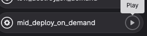
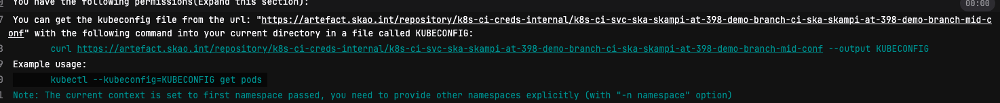
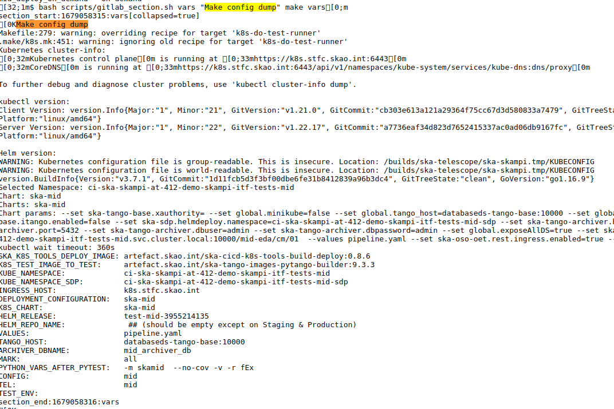
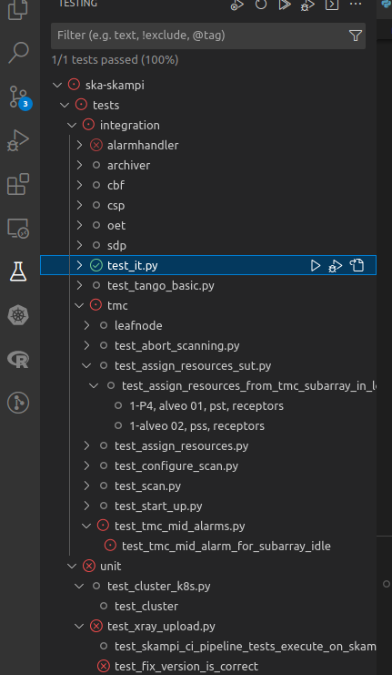

#################################################################
Running SKAMPI Tests Locally
#################################################################

+++++++++++++++++++++++++++++++++++
Set Environment to run test locally
+++++++++++++++++++++++++++++++++++

* Clone the SKAMPI Repo
.. code-block:: console

   $ git clone https://gitlab.com/ska-telescope/ska-skampi.git
   $ cd ska-skampi
* Checkout to your working branch
.. code-block:: console

    $ git checkout -b at-398-demo-branch
* make a commit (optional)
* push to remote
.. code-block:: console

    $ git push
* Create Merge Request(MR) on gitlab
* Navigate to the Pipeline view(under CI/CD heading) for the MR
* Hit Play on the deploy-on-demand job that best fits your goal (the facility is typically in the name of the job, except for STFC Cloud, which is the "1st class citizen" of Skampi pipelines.

* Navigate to the job logs(under CI/CD heading) and wait for the link to the job output. Once the job has completed, click on the Landing Page URL to confirm the deployment.
* Copy the KUBECONFIG file to your local machine - use the curl command given in the pipeline output (near the top - see screenshot). This KUBECONFIG file is used by any Kubernetes client ( kubectl , k9s , the VSCode kubernetes plugin, etc).

* You should now be able to connect to the cluster. Set the kubeconfig of your VSCode Kubernetes plugin to point to this cluster, so that you can see the resources (click on the three dots of that plugin's window panel and select "Set Kubeconfig" option).
* Locate the pipeline test job environment variable by searching for "Make config dump" in the logs. Scroll down a bit to see them.

* Set the environment variables on your local machine to match those used by the pipeline test jobs.
.. code-block:: console

    . setenv

++++++++++++++++++++++++++++
Testing and Debugging
++++++++++++++++++++++++++++
* If you try to confirm whether or not the deployment worked, one way could be to try to access the landing page or Taranta Dashboards deployed with Skampi software.
* Make sure you are connected to the VPN.
* Checkout the relevant branch and open it in the Dev Container.
* Run poetry install in the terminal to install dev dependencies and plugins. (Some packages fail to install here, like skallop)
* To manually install skallop, see the the link `here <https://gitlab.com/ska-telescope/ska-ser-skallop#usage-and-installation>`_, otherwise you will not be able to run the next step.
* To be able to run tests on the remote cluster, run the following command.
.. code-block::

    $ . setenv.sh
* The above command will ask you to choose a branch name, telescope and taranta username and password.
* Copy the contents of the command output to your vscode .env file.
* To check that you can communicate with the cluster, you need to run pingmvp command. You need to have skallop installed.
.. code-block:: console

    $ pingmvp

you should see output like ``got response from sys/database/2``

* If your test discovery is not working, try re-launching the Gitlens extension. You should be having something like below:

* To check list of pods deployed run following command
.. code-block:: console

    $ kubectl --kubeconfig=KUBECONFIG get pods
* To check logs of particular pod run following command (This will be useful to debug test failure)
.. code-block:: console

    $ kubectl --kubeconfig=KUBECONFIG logs <pod_name>
* You can also run particular test from terminal
.. code-block:: console

    $ pytest tests/integration/tmc/test_assign_resources.py

