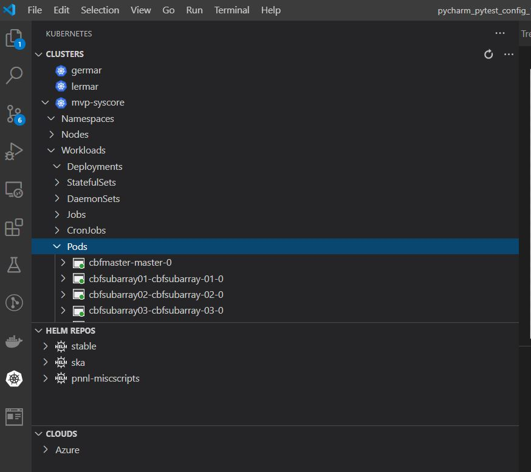
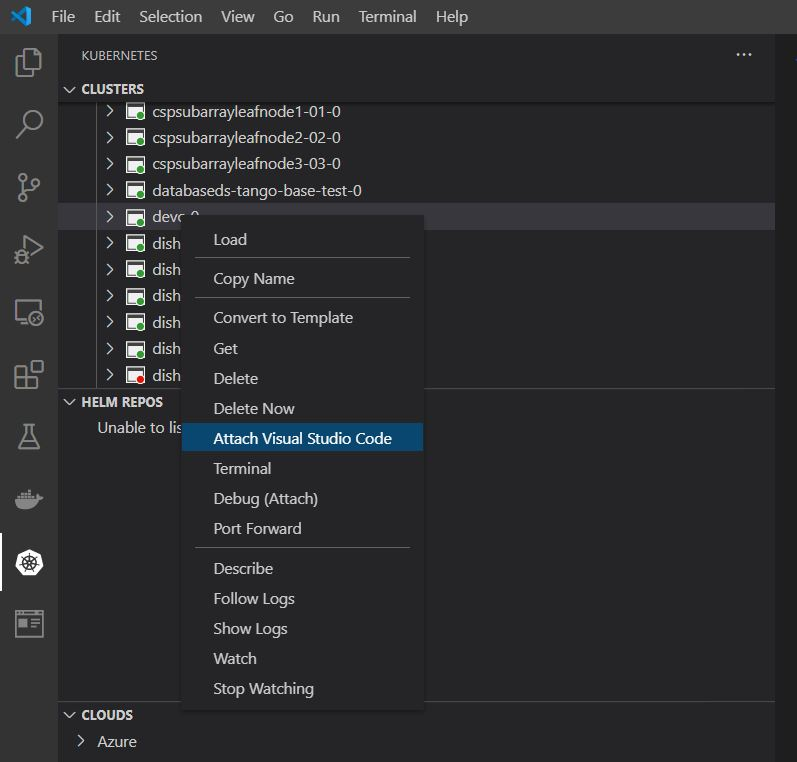
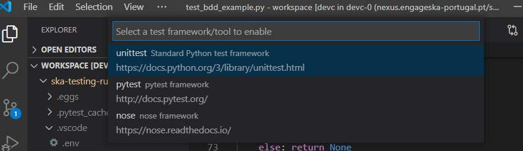
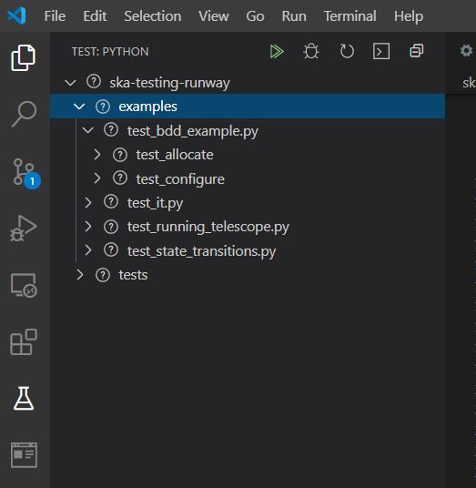

===================
Working with VSCode
===================

The examples in this page was done with the following vscode version and extensions

     - `Vscode <https://code.visualstudio.com/>`_: 1.52
     - `Kubernetes <https://marketplace.visualstudio.com/items?itemName=ms-kubernetes-tools.vscode-kubernetes-tools>`_: 1.2.1
     - `Pylance <https://marketplace.visualstudio.com/items?itemName=ms-python.vscode-pylance>`_: 2021.1.2

Attaching to remote kubernetes pod
----------------------------------

If you have kubectl working correctly with provided KUBECONFIG credentials, the kubernetes extension
will be able to pick up the kubernetes contexts that are available to you (see below):

Once you have selected the correct context you can now deploy the devc helm installation (dev storage is to persist any changes to data) for doing dev work in the K8 environment. 

.. code-block:: bash

    helm install devstorage ska/dev_storage
    helm install devc ska/devc

Once you have sucessfully installed devc and you can see it running in the kubernetes window, right click on the pod and select attach vscode. 

.. Note:

    Attach VS code feature only works when you are running VScode from a windows platform.

Vscode will then proceed to install a server for running processes remotely inside the selected pod. After the installation is finished you can create a workspace in `/app/workspace`.
In this directory you can clone skampi and run tests from within the IDE. Note in order to make use of extensions you will have to re install them in the remote pod also.

Test using the vscode python test explorer
------------------------------------------

Once you have enabled python (via pylance), VScode will prompt you to select the python interpreter it must use. If you have opted to install python using virtualenv, make sure you select the interpreted in the venv library.
Once the interpreter is selected you can enable pytest using the command `Python: Configure Tests`. Select pytest as your testing framework, then select the location of your setup.cfg file (/post-deployment).

To ensure your tests can access modules in other folders within your repo, 
make sure that the PYTHONPATH env variable points to the root folder of those nodules. To set an env var for Vscode you create a `.env` file inside the `.vscode/` folder with the env value expressed inside the text file as per 
example below:

.. code-block:: bash

    PYTHONPATH=/app/workspace/skampi/post-deployment

You may need to reload the window in order for VScode to pick up changes to the env var settings.
If the paths are correctly setup the test explorer should show a window with all tests loaded. Select and run these tests accordingly.

